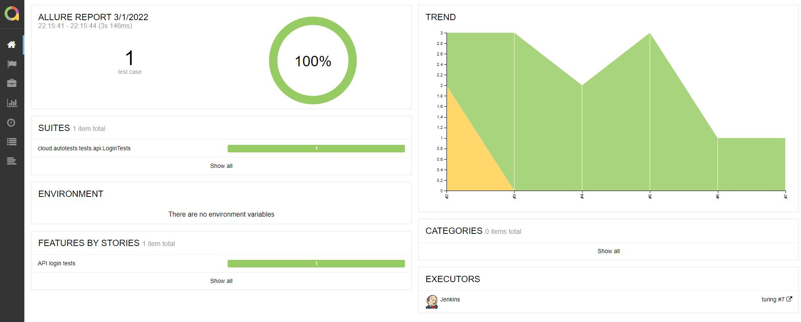

# The test automation project for https://www.turing.com/
[Github](https://github.com/autotests-cloud/turing)

  

___
## The project technologies:

<code>

</code>

___

## Results

The test results can be found in:
+ [Jenkins](#jenkins)
+ [Allure Report](#allure-report)
+ [Allure TestOps](#allure-testOps)

### Jenkins

[Jenkins job](https://jenkins.autotests.cloud/job/turing/)

  

  

### Allure Report

:arrow_right: [The launch with results](https://jenkins.autotests.cloud/job/turing/6/allure/)

:arrow_right: [The launch Allure Report](https://qameta.io/allure-report/)

#### Allure Report
+ Attachments
+ Various test types in one report
+ Nested Steps
+ BDD and Gherkin
+ Easy integration with custom tools
+ Filter and search
+ Pluggable System
+ Export in a format you love

  

  

  

  

### Allure TestOps

:arrow_right: [The launch with results](https://allure.autotests.cloud/project/1054/launches)

:arrow_right: [The launch Allure Report](https://qameta.io/)

#### Allure TestOps

+ A central hub for all your tests
+ Live documentation
+ Metrics and KPIs
+ Security
+ Analytics
+ Aggregation
+ Configuration
+ Performance
+ Integrations

  

  

  

___

## Notifications in Telegram channel

  

___
